<div align="center">

# Loadout

Balance your team's week and spot meeting overload before it happens

[![Live][badge-site]][url-site]
[![HTML5][badge-html]][url-html]
[![CSS3][badge-css]][url-css]
[![JavaScript][badge-js]][url-js]
[![Claude Code][badge-claude]][url-claude]
[![License][badge-license]](LICENSE)

[badge-site]:    https://img.shields.io/badge/live_site-0063e5?style=for-the-badge&logo=googlechrome&logoColor=white
[badge-html]:    https://img.shields.io/badge/HTML5-E34F26?style=for-the-badge&logo=html5&logoColor=white
[badge-css]:     https://img.shields.io/badge/CSS3-1572B6?style=for-the-badge&logo=css3&logoColor=white
[badge-js]:      https://img.shields.io/badge/JavaScript-F7DF1E?style=for-the-badge&logo=javascript&logoColor=black
[badge-claude]:  https://img.shields.io/badge/Claude_Code-CC785C?style=for-the-badge&logo=anthropic&logoColor=white
[badge-license]: https://img.shields.io/badge/license-MIT-404040?style=for-the-badge

[url-site]:   https://loadout.neorgon.com/
[url-html]:   #
[url-css]:    #
[url-js]:     #
[url-claude]: https://claude.ai/code

</div>

---

## Overview

Loadout turns your team's week into an RPG party board. Add teammates as character chips, drop meeting puzzle pieces onto Monday through Friday, then drag people onto the meetings they attend. Each person's workload fills a bottle meter as their week gets heavier, so you see who is drowning in syncs and who has room to spare, before anyone burns out.

Load is real weighted meeting-hours, not a raw meeting count. Five 15-minute standups never outweigh three hour-long customer calls, because every block carries a duration and a recurrence that feed the number.

**Live:** loadout.neorgon.com

---

## Features

- **Drag your party onto meetings** -- pull character chips onto puzzle-piece blocks; a chip's ring fills green to red as their load climbs
- **Weighted meeting-hours** -- load is duration times weekly recurrence times attendance, so the meter reflects real cost
- **Multiple weeks** -- plan a run of weeks as tabs, switch between them, duplicate a week to carry a stable cadence forward, or add a blank one; not every week is the same
- **Average load, per-week spikes** -- bottle meters show each person's average across all weeks, while the Signals drawer still flags an overload in any single week so a busy launch week never hides behind a quiet one
- **Bottle meters** -- each teammate gets a liquid gauge with an etched overload line; the bottle overflows and flickers red when they cross it
- **Team profiles** -- New, Experienced, and Support presets set a starting overload threshold you can then tune with a slider
- **Signals drawer** -- flags overloaded and under-loaded people, oversized meetings, likely duplicates, and syncs that happen too often
- **Puzzle-piece week** -- Monday to Friday columns of interlocking meeting blocks, no hours to fuss over
- **Fully local** -- everything saves to your browser, no accounts, no backend, keyboard and drag both supported

---

## Meeting types

Daily -- Weekly -- Monthly -- 1:1 -- Customer sync -- Follow-up -- Custom. Each ships with a sensible default duration and cadence, a color, and a "sane attendee cap" the signals engine uses to flag bloat (a 1:1 with eight people gets called out). Click a block's duration or cadence chip to change it.

---

## Running locally

ES modules require an HTTP server (not `file://`):

```bash
python3 -m http.server 8850
```

Then open http://localhost:8850/, or run `make serve` from this folder.

---

## Architecture



```
loadout-site/
├── index.html          # App shell: header, preset strip, roster, board, drawer
├── css/
│   └── style.css       # Neorgon tokens + puzzle blocks, bottle meters, chips, drag FX
├── js/
│   ├── app.js          # Entry point — loadState, render, bindEvents
│   ├── state.js        # Roster + weeks + meetings, localStorage (loadout-v1), snapshot/undo
│   ├── data.js         # Meeting types, presets, recurrence weighting, class colors
│   ├── load.js         # Weighted meeting-hours model — per-week + multi-week average
│   ├── insights.js     # Per-week overload / duplicate / oversized / frequency flags
│   ├── render.js       # Week tabs, roster chips, week board, puzzle blocks, bottle wall
│   ├── events.js       # Pointer drag + keyboard seating, meeting CRUD, presets
│   └── utils.js        # genId, escHtml, debounce, initials, fmtHours, toast
├── CNAME               # loadout.neorgon.com
├── robots.txt          # Bot allowances
└── sitemap.xml         # Single-URL sitemap
```

---

<div align="center">
<sub>Part of <a href="https://neorgon.com/">Neorgon</a></sub>
</div>
